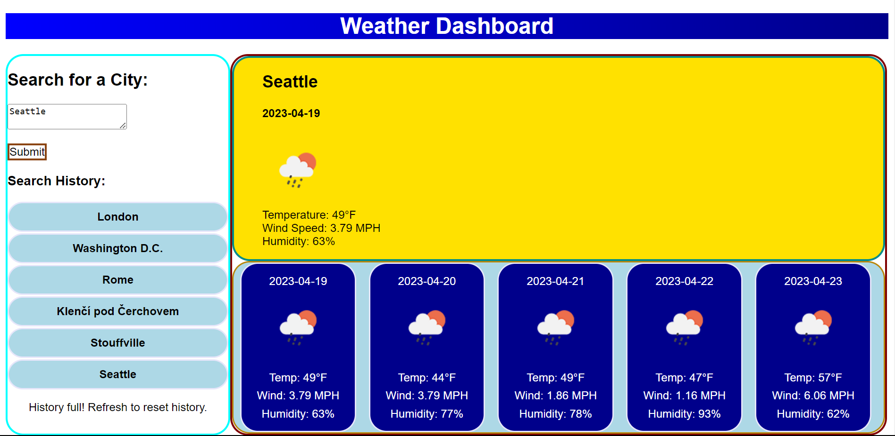

# Weather Dashboard
This is the repository for the Module 6 Challenge of Joseph Rodante in Rutgers Coding Bootcamp

- This application gives details about the weather over a 5 day period of a town or city entered by the user

## Installation
- N/A
- [Link to Application](https://joeyrodo.github.io/Weather-Dashboard/)

## Usage 
- Click the text box to enter the name of a city or town.
- Click "Submit" to get the 5 day weather forecast for the town or city entered. The city will be logged in the "History" area.
- Click on a perviously searched town or city in the "History" area to get the for that area without typing the name of the area again.
